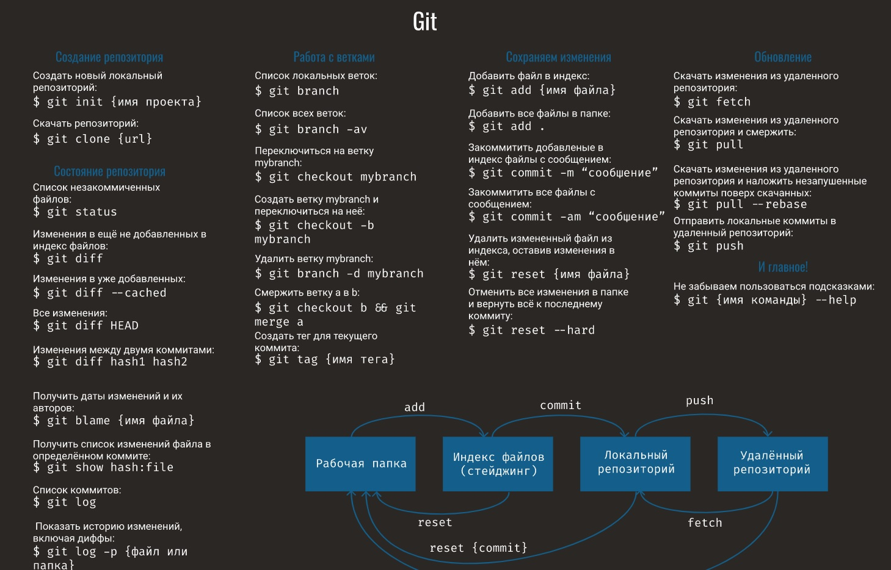

# Работа с git

## 1. Установка Git
Загружаем последнюю версию Git с сайта https://git-scm.com/downloads
Устанавливаем с настройками по умолчанию
## 2. Проверка наличия установленного Git
В терминале выполнить команду ***get version***
Если Git установлен, появится сообщение с информацией о версии программы. Иначе будет сообщение об ошибке.
## 3. Настройка Git
При первом использовании Git необходимо представиться. Для этого нужно ввести в терминале две команды:

**git config --global user.name "Ваше имя"**

**git config --global user.email Ваша почта@example.com"**
## 4. Инизиализация репозитория
Для создания нового репозитория вводим команду 
**git init**. При этом создается новый подкаталог с именем .git, который содержит все необходимые файлы репозитория — скелет репозитория Git. 
## 5. Запись изменений в репозиторий
Чтобы увидеть, в каком состоянии находятся файлы, применяем команду  **git status**.
Она показывает на какой ветке мы находимся и какие файлы являются отслеживаемыми и неостлеживаемыми. 

Чтобы начать отслеживать новый файл  используем команду **git add**

Если нам нужно увидеть что мы изменили, а не только какие файлы были изменены —  используем команду  **git diff**. 

Затем можно зафиксировать изменения. 
Самый простой способ фиксации — ввести **git commit -m "Комментарий к изменению"**

## 6. Основные команды Git

* **git init** – инициализация локального репозитория
* **git status** – получить информацию от git о его текущем состоянии
* **git add** – добавить файл или файлы к следующему коммиту
* **git commit -m “message”** – создание коммита.
* **git log** – вывод на экран истории всех коммитов с их хеш-кодами
* **git checkout** – переход от одного коммита к другому
* **git checkout master** – вернуться к актуальному состоянию и продолжить работу
* **git diff** – увидеть разницу между текущим файлом и закоммиченным файлом

## 7. Просмотр истории коммитов

После того, как мы создали несколько коммитов можно помсотреть историю сохранения.
Для этого используем команду **git log** - она выводит на экран историю всех коммитов с их хеш-кодами

Для просмотра множество коммитов удобно использовать команду **git log --oneline**  - она печатает каждое сохранение в одной строчке

## 8. Перемещение между сохранениями
Для просмотра разных сохраненных версий файлов можно исполтзовать команду  **git checkout**
Для возвращение к работе в актуальной версии необходимо ввести команду**git checkout master**

## 9. Работа с ветками
**Для чего нужны ветки**
1. Ветки нужны, чтобы несколько программистов могли вести работу над одним и тем же проектом или даже файлом одновременно, при этом не мешая друг другу.
2. Ветки используются для тестирования экспериментальных функций: чтобы не повредить основному проекту, создается новая ветка специально для экспериментов. Если эксперимент удался, изменения с экспериментальной ветки переносятся на основную, если нет – новая ветка попросту удаляется, а проект остается нетронутым.
3. Ветки можно использовать для разных выходящих параллельно релизов одного проекта. 

**Cоздание ветки**
Создать свою ветку можно двумя способами.
1. Команда **git branch <имя ветки>**
  Переключится на новую ветку можно с помощью команды **git checkout <имя ветки>**
2. Команда **git checkout -b <имя ветки>** - создает новую ветку и переключается на неё

**Слияние веток**

Слияние используется в Git, чтобы собрать воедино разветвленную историю.
Команда **git merge** объединяет несколько последовательностей коммитов в общую историю. Чаще всего команду **git merge** используют для объединения двух веток. 
Для слияния необходимо перейти в ту ветку, в которой необходимо произвести слияние

**Удаление веток**

Когда речь доходит до удаления чего-либо, нужно быть очень осторожным. Когда вы удаляете ветку, все изменения, которые не были добавлены в коммит, будут утеряны.
Для удаления мы воспользуемся командой **git branch** с ключами -d и -D
-d - ветка будет удалена в случае, если она полностью слита с другой веткой. В противном случае, Git даст предупреждение о том, что в ветке есть неслитые изменения и не даст удалить её
-D - этот ключ в любом случае удалит ветку, даже если в ней есть изменения.

## 10. Работе с удалёнными репозиториями
### Создание удаленного репозитория
1. Cоздаем аккаунт на Github
2. Создаем локальный репозиторий
3. Связываем локальный и удаленный репозиторий. Подсказки по командам находятся в Github
4. Отправляем (**команда push** ) локальный репозиторий в удаленный (на Github)
5. При изменении удаленного репозитория для обновления локального и актуализации данных используем **команду pull**