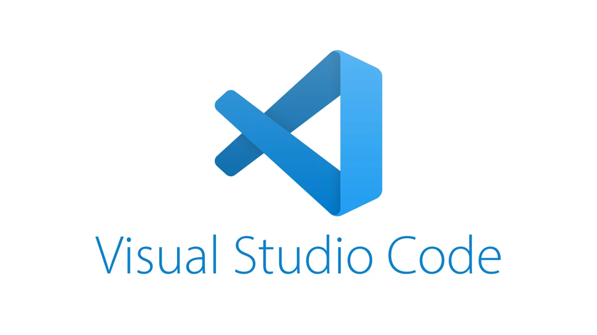
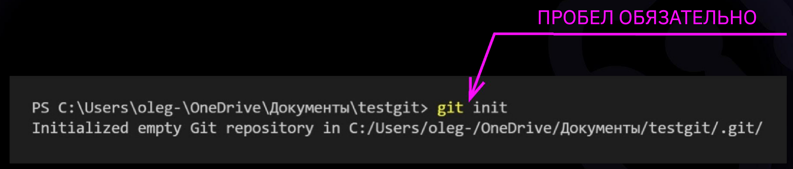
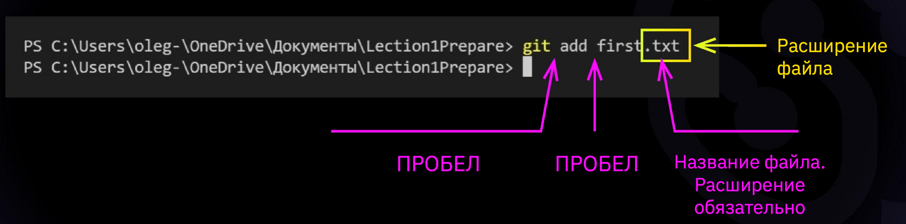
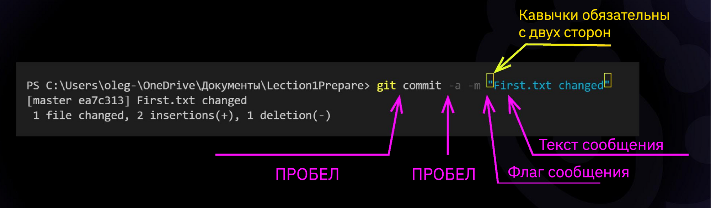
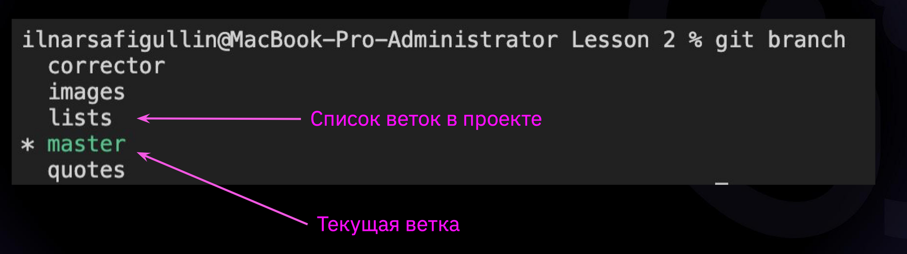
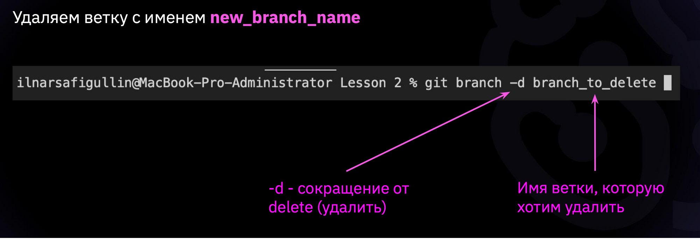
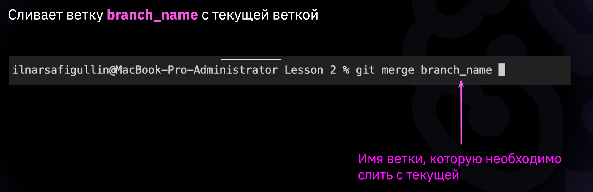

# Введение в контроль версий

__*Контроль версий (КВ)*__ предназначен для хранения и возвращения к различным версиям вашего проекта.

__*GIT*__ - самая популярная система КВ

## Установка GIT и Visual Studio Code

* Установка Git для Windows, MAC, Linux: https://git-scm.com/downloads 
* Установка VSCode для Windows, MAC, Linux: https://code.visualstudio.com/Download

При первом использовании Git необходимо представиться.

Для этого нужно ввести в терминале 2 команды:

* __*git config --global user.name «Ваше имя английскими буквами» git**__
* __*config --global user.email ваша почта@example.com**__

## Основные команды GIT

* __*git init*__ - инициализация локального репозитория. Создаётся скрытая папка .git

* __*git status*__ – получить информацию от git о его текущем состоянии
* __*git add*__ – добавить файл или файлы к следующему коммиту

* __*git commit -m “message”*__ – создание коммита

* __*git log*__ – вывод на экран истории всех коммитов с их хеш-кодами

* __*git log --graph*__ - отображение всех ветвлений в виде дерева
* __*git checkout*__ – переход от одного коммита к другому
* __*git checkout master*__ – вернуться к актуальному состоянию и продолжить работу
* __*git diff*__ – увидеть разницу между текущим файлом и закоммиченным файлом

* __*git branch*__ - посмотреть список веток в репозитории

* __*git branch <название ветки>*__ – создать новую ветку
* __*git checkout <название ветки>*__ – переход к другой ветке
* __*git branch -d <название ветки>*__ – удалить ветку

* __*git merge <имя ветки>*__ - вызвать слияние с другой веткой

* __*git pull*__ – получение изменений и слияние с локальной версией
* __*git push*__ – отправляет локальную версию репозитория на внешний
* __*pull request*__ - команда для предложения изменений в репозиторий

## Инструкция по работе с pull request

1. Делаем ответвление репозитория (__*fork*__)
2. Клонируем свою версию репозитория в терминале (__*git clone <ссылка>*__)
3. С помощью команды __*cd*__ переходим в недавно склонированную директорию и создаём ветку, в которую будем вносить свои изменения (__*git branch*__)
4. Вносим изменения, сохраняем файлы, создаём коммиты (__*git add, git commit -m*__)
5. "Пушим" свои изменения в GitHub (__*git push*__)
6. Заходим на сайт GitHub, нажимаем на кнопку pull request

## [Ссылка на сайт с описанием синтаксиса Markdown](https://docs.microsoft.com/ru-ru/contribute/markdown-reference)

* Заголовок (#) – выделение заголовков. Количество символов “#” задаёт уровень заголовка (поддерживается 6 уровней).
* = или - – подчёркиванием этими символами (не менее 3 подряд) выделяют заголовки
первого (“=”) и второго (“-”) уровней.
* **Полужирное начертание** задаётся при помощи двойных звёздочек (**) или двойного подчёркивания (__)
* *Курсивное начертание* или _Курсивное начертание_ задаётя с помощью одной звёздочки (*) или подчёркивания (_)
* ***Полужирное курсивное начертание*** применяется с помощью трёх звёздочек (***)
* ~~Зачеркнутый текст~~ применяется с помощью двух тильд (~~)
* Строка – ненумерованные списки, символ “*” в начале строки
* 1, 2, 3 … – нумерованные списки