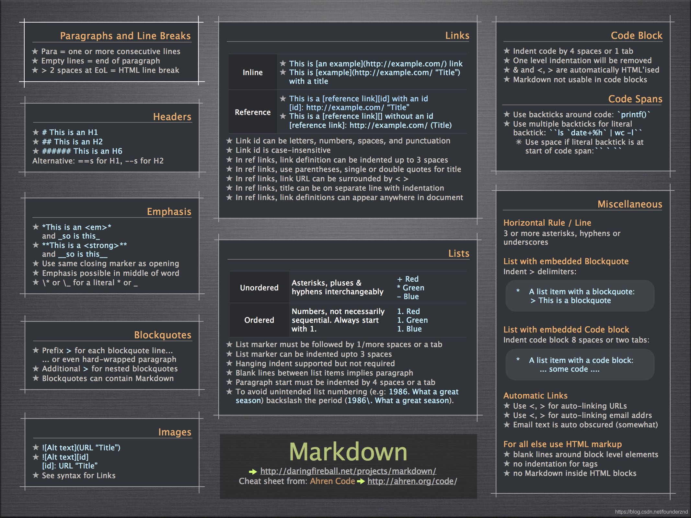

# Инструкция по работе с Git #

**Для того, чтобы создать пустой репозиторий нужно**  

> *git init*

**Чтобы начать сохранение файла с именем file_name, нужно:**  
> git add file_name или git add . 

**Созадние коммита: (комментарий для программиста)**  
> git commit -m message "your_text"

Журнал всех коммитов:  
> git log

Чтобы вернуться к какому-то коммиту нужно:  
>git checkout <хэш_код>  
>git checkout master (вернуться к последней версии)

Чтобы увидеть разницу между текущем и закоммиченным файлом нужно:  
> git diff

### Основные команды Markdown: 
___ 

___

## Также в случае необходимости можно перейти по ссылке с целью просмотра шпаргалки:  
**[Markdown](https://docs.microsoft.com/ru-ru/contribute/markdown-reference)**

Чтобы вывести все ветки на экран мы используем:  
> git branch

С целью работы с уадленными репозиториями необхордимо зарегистрироваться на
 **[GitHub](https://github.com/)**

Чтобы создать новую ветку мы используем команду:  
* git branch branch_name\

## Новые команды:  
+ git commit -a -m "message" сохранение текущего файла с добвалением коммита
* git checkout -b branch_name создание и переход к ветке с именем branch_name

Чтобы перейти к другой ветке мы используем:  
1. git checkout <название ветки>

Чтобы удалить ветку с **замерженными** изменениями мы используем:  
* git branch -d branch_name
Чтобы удалить ветку с **незамерженными** изменениями мы используем:  
* git branch -D branch_name

С целью работы с уадленными репозиториями необхордимо зарегистрироваться на
 **[GitHub](https://github.com/)**

**Может употребляться в Markdown перед специальными символами для того, чтобы они воспринимались в их буквальном (а не служебном) значении. Полный список данных символов приводится ниже:**
____
* «\» - слеш;
* «`» - обратный апостроф;
* «*» - звездочка;
* «_» - символ подчеркивания;
* «{}» - фигурные скобки;
* «[]» - квадратные скобки;
* «()» - круглые скобки;
* «#» - символ решетки;
* «+» - плюс;
* «-» - минус (дефис);
* «.» – точка;
* «!» - восклицательный знак.

*Для того чтобы сохранить и закоммитить можно ввести слудеющую команду:*  
- git commit -a -m "commit"

## Чтобы скопировать репозиторий с GitHub мы используем:  
- git clone <link>

**Чтобы сгрузить на GitHub изменения мы используем:** 
1. git push

### Чтобы выгрузить с GitHub изменения в локальный репозиторий мы используем:
* git pull

 