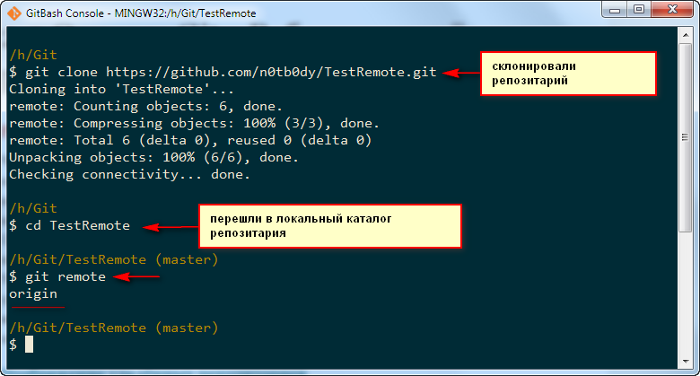

# Основы Git - Работа с удалёнными репозиториями.

Удалённые репозитории — это модификации проекта, которые хранятся в интернете или ещё где-то в сети. Их может быть несколько, каждый из которых, как правило, доступен для вас либо только на чтение, либо на чтение и запись. Совместная работа включает в себя управление удалёнными репозиториями и **помещение (push) и получение (pull)** данных из них тогда, когда нужно обменяться результатами работы.

**Отображение удалённых репозиториев.**

Чтобы просмотреть, какие удалённые серверы у вас уже настроены, следует выполнить команду git remote. Она перечисляет список имён-сокращений для всех уже указанных удалённых дескрипторов. Если вы склонировали ваш репозиторий, у вас должен отобразиться, по крайней мере, origin — это имя по умолчанию, которое Git присваивает серверу, с которого вы склонировали:

Чтобы посмотреть, какому URL соответствует сокращённое имя в Git, можно указать команде опцию **-v**:

**Добавление удалённых репозиториев**

Чтобы добавить новый удалённый Git-репозиторий под именем-сокращением, к которому будет проще обращаться, выполните **git remote add [сокращение] [url]**:

Теперь вы можете использовать в командной строке имя **tr** вместо полного URL.

Например, я сделал некоторые изменения файла README.md и теперь загрузим их себе в локальный репозиторий командой **git fetch**:

Теперь ветка изменений с сервера доступна локально как tr/mater. Вы можете слить (merge) её в одну из своих веток или перейти на эту ветку, если хотите её проверить.

Тут надо отметить, что между командами ***git pull и git fetch*** есть разница, но об этом чуть позже.

На данный момент, если мы посмотрим содержимое файла README.md в рабочем каталоге, то оно будет точно такое же, как было до команды _git fetch_. Это потому, что мы в данный момент находимся в ветке master локального репозитария, которая не была изменена.

Чтобы посмотреть все существующие ветки можно дать команду **git branch с ключом –a**, который покажет все ветки репозитория.

Здесь активная ветка обозначена звёздочкой. А так же мы видим ветку которую мы притянули командой *git fetch – это ветка remotes/tr/master*. Собственно об этом нам команда git fetch и сообщила после выполнения.

Переключится на ветку можно командой **git checkout <имя ветки>**

И так мы переключились на ветку которую стянули командой git fetch, о чем нам выдалось сообщение и рассказали какие файлы были обновлены. Это файл README.md. Теперь в рабочем каталоге мы можем посмотреть измененное содержимое этого файла (мы его меняли непосредственно на GitHub).

Мы так же можем переключится обратно на нашу ветку master.

Теперь будем разбираться с разницей между **fetch и pull**.

Fetch и Pull

Как вы только что узнали, для получения данных из удалённых проектов, следует выполнить:

$ git fetch [имя удал. сервера]

Данная команда связывается с указанным удалённым проектом и забирает все те данные проекта, которых у вас ещё нет. После того как вы выполнили команду, у вас должны появиться ссылки на все ветки из этого удалённого проекта. Теперь эти ветки в любой момент могут быть просмотрены или слиты (объединены).

Когда вы клонируете репозиторий, команда clone автоматически добавляет этот удалённый репозиторий под именем origin. Таким образом, git fetch origin извлекает все наработки, отправленные (push) на этот сервер после того, как вы склонировали его (или получили изменения с помощью fetch). Важно отметить, что команда fetch забирает данные в ваш локальный репозиторий, но не сливает (не объединяет) их с какими-либо вашими наработками и не модифицирует то, над чем вы работаете в данный момент. Вам необходимо вручную слить эти данные с вашими, когда вы будете готовы.

Если у вас есть ветка, настроенная на отслеживание удалённой ветки, то вы можете использовать команду git pull. Она автоматически извлекает и затем сливает (объединяет) данные из удалённой ветки в вашу текущую ветку. Этот способ может для вас оказаться более простым или более удобным. К тому же по умолчанию команда git clone автоматически настраивает вашу локальную ветку master на отслеживание удалённой ветки master на сервере, с которого вы клонировали (подразумевается, что на удалённом сервере есть ветка master). Выполнение git pull, как правило, извлекает (fetch) данные с сервера, с которого вы изначально склонировали, и автоматически пытается слить (объеденить) (merge) их с кодом, над которым вы в данный момент работаете.

**Push**

Когда вы хотите поделиться своими наработками, вам необходимо отправить (push) их в главный репозиторий. Команда для этого действия простая: git push [удал. сервер] [ветка]. Чтобы отправить вашу ветку master на сервер origin (повторимся, что клонирование, как правило, настраивает оба этих имени автоматически), вы можете выполнить следующую команду для отправки наработок на сервер:

**$ git push origin master**

Эта команда срабатывает только в случае, если вы клонировали с сервера, на котором у вас есть права на запись, и если никто другой с тех пор не выполнял команду push. Если вы и кто-то ещё одновременно клонируете, затем он выполняет команду push, а затем команду push выполняете вы, то ваш push точно будет отклонён. Вам придётся сначала вытянуть (pull) их изменения и объединить с вашими. Только после этого вам будет позволено выполнить push.

Я выполнил команды pull и объединил изменения для файла README.md и затем залил их на сервер GitHub. Скрин привожу просто для информации чтобы было видно как это делается.

Более подробно как отправлять (push) данные на удалённый сервер мы рассмотрим чуть позже.

**Инспекция удалённого репозитория**

Если хотите получить побольше информации об одном из удалённых репозиториев, вы можете использовать команду git remote show [удал. сервер]. Если вы выполните эту команду с некоторым именем, например, origin, вы получите что-то подобное:

Она выдаёт URL удалённого репозитория, а также информацию об отслеживаемых ветках. Эта команда любезно сообщает вам, что если вы, находясь на ветке master, выполните git pull, ветка master с удалённого сервера будет автоматически влита в вашу сразу после получения всех необходимых данных. Она также выдаёт список всех полученных ею ссылок.

Данная команда так же показывает какая именно локальная ветка будет отправлена на удалённый сервер по умолчанию при выполнении git push. Она также показывает, каких веток с удалённого сервера у вас ещё нет, какие ветки всё ещё есть у вас, но уже удалены на сервере.

**Удаление и переименование удалённых репозиториев.**

Для переименования ссылок в новых версиях Git'а можно вылолнить git remote rename, это изменит сокращённое имя, используемое для удалённого репозитория. Например, если вы хотите переименовать tr в tstrmt, вы можете сделать это следующим образом:

Стоит упомянуть, что это также меняет для вас имена удалённых веток. То, к чему вы обращались как tr/master, стало tstrmt/master.

Если по какой-то причине вы хотите удалить ссылку (вы сменили сервер или больше не используете определённое зеркало, или, возможно, контрибьютор перестал быть активным), вы можете использовать git remote rm:

Не большое пособие о работе с удаленным репозиторием.